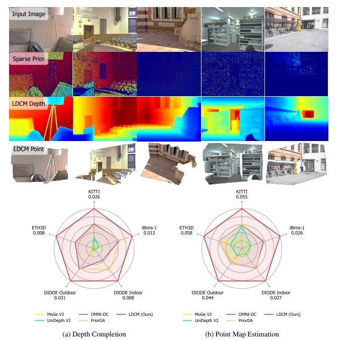

# LDCM: Large Depth Completion Model from Sparse Observations

<p align="center">
  
</p>

## 📝 Introduction
**LDCM** is a high-performance depth completion framework. It effectively reconstructs high-fidelity **dense metric depth maps** from a single RGB image and sparse depth measurements.

---

## Poisson Completion Usage

The Poisson completion utility refines a dense monocular depth prior with sparse metric depth observations. MoGe is loaded with `from_pretrained` to estimate the monocular depth prior, then the prior is passed directly to Poisson completion.

```python
import torch
from ldcm.moge.model.v2 import MoGeModel
from ldcm.poisson_completion import poisson_completion

device = "cuda"

# image: RGB tensor in [0, 1], shape [B, 3, H, W].
# sparse_depth: metric sparse depth, shape [B, 1, H, W].
# Invalid sparse-depth pixels should be 0.
image = image.to(device)
sparse_depth = sparse_depth.to(device)

moge = MoGeModel.from_pretrained("Ruicheng/moge-2-vits-normal").to(device).eval()

with torch.no_grad():
    moge_output = moge.infer(image, apply_mask=False)
    mono_depth = moge_output["depth"].unsqueeze(1)  # [B, 1, H, W]

    completed_depth = poisson_completion(
        sparse=sparse_depth,
        mono_depth=mono_depth,
        num_scales=4,
        thres=3.0,
        lamda=5.0,
        rtol=1e-5,
        max_iter_per_scale=[5000, 2000, 1000, 500],
        max_resolution_ratio=1.0,
    )
```

The output `completed_depth` has shape `[B, 1, H, W]`. The solver first aligns the monocular prior to the sparse metric depth and then runs multi-scale Poisson optimization from coarse to fine. An optional `confidence` map with shape `[B, 1, H, W]` can be passed to weight the monocular-gradient term during Poisson solving.

## 🛠 Roadmap
- [x] Release MoGe-based Poisson completion code.
- [ ] Release project paper and technical details.
- [ ] Release pre-trained models.
- [x] Support for spatio-temporal video depth completion.
